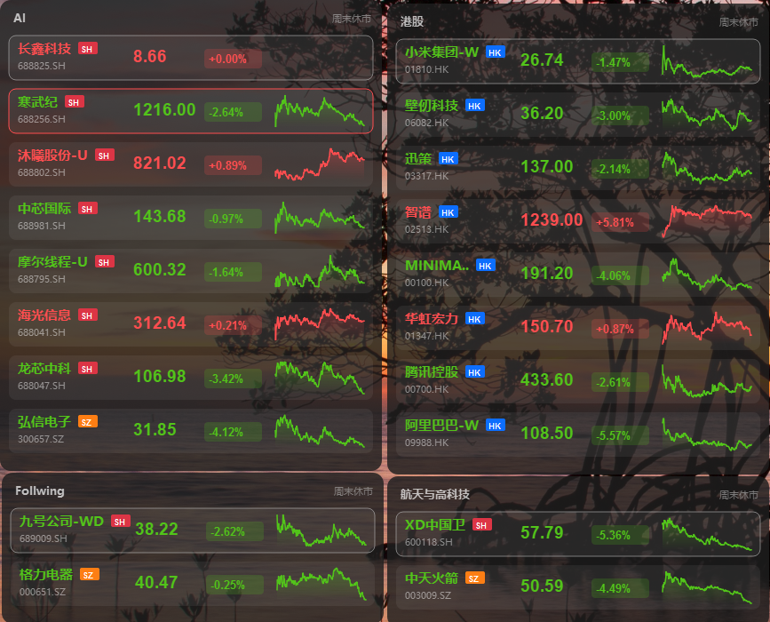

<div align="center">

# 💹 ITGeeker Stock Widget

**贴在桌面上的股票小组件 —— 让自选股成为视野的一部分，而不是必须切换才能看到的应用。**

<br>


<br>

一款基于 **Python + PySide6** 的 Windows 桌面股票小组件
支持 **A 股 / 港股 / 美股** 多市场、分组管理、桌面悬浮卡片、涨跌幅阈值提醒
**开源 · 可二次开发 · 可打包成单文件 EXE**

[📸 效果预览](#-屏幕截图--效果演示) · [🚀 快速上手](#-快速上手-getting-started) · [⚙️ 配置说明](#-配置说明-configuration) · [🤝 贡献指南](#-贡献指南-contributing) · [📜 开源协议](#-开源协议-license)

<br>

</div>

---

## 📖 项目简介

**ITGeeker Stock Widget** 是一款专为个人投资者打造的轻量级 **Windows 桌面股票小组件**。它把"自选股列表 + 分组 + 实时刷新 + 涨跌幅预警 + 详情图表 + 系统托盘"打包成一张张无边框、半透明、可拖拽的悬浮卡片，安静地贴在桌面边角，让你在不切换交易软件、不掏手机的情况下，**瞄一眼就能感知到市场的"呼吸"**。

它解决的是这样一类**真实而普遍的痛点**：

- 🖥️ **桌面党盯盘**：工作时打开交易软件又重又慢，频繁切换既打断思路又影响专注力。
- 📱 **手机党盯盘**：上班摸鱼掏手机看行情容易"撞见老板"，信号差时加载半天错过窗口期。
- 📊 **网页党盯盘**：同花顺、雪球等网页臃肿、广告乱飞，打开后 CPU 风扇立刻咆哮。
- 🗂️ **自选股分组混乱**：持仓、ETF、港美股、主题投资……原生 App 无法按主题归档。
- 🔔 **异动提醒缺失**：无法在价格突破关键阈值时，第一时间以不打扰的方式提醒你。

> **本项目 = 一个开源、轻量、可二次开发的"桌面股票天气小组件"**。它不绑定券商、不登录注册、没有付费墙，所有配置保存在本地 JSON，源码完全开放。

---

## ✨ 核心特性

> 以下特性基于当前 **v1.3.12.0** 版本，未来将持续迭代。

### 🎯 多市场多币种

- 🇨🇳 **A 股全覆盖**：沪 A、深 A、科创板、京 A，人民币计价
- 🇭🇰 **港股支持**：港币计价，蓝色市场徽标一眼可辨
- 🇺🇸 **美股支持**：美元计价，跨市场持仓也能优雅展示
- 🎨 **彩色市场徽标**：沪 A 红色 / 深 A 橙色 / 港股蓝色 / 其他灰色

### 🧩 分组管理

- 📁 **多分组卡片**：每个主题一张悬浮卡片，"持仓 / AI 算力 / 港美股 / 高息电力" 互不干扰
- ➕ **自由增删改**：支持新建、改名、删除、整体打开分组
- 🔍 **智能搜索**：按股票代码或**名称关键字**（如"格力""腾讯"）模糊搜索
- 📥 **CSV 批量导入导出**：换设备迁移、备份分享一键搞定

### 🪟 桌面小组件

- 🎨 **无边框 + 半透明 + 圆角**：和桌面壁纸融为一体，不抢戏不喧宾夺主
- 🖱️ **可拖拽 + 可置顶**：卡片摆哪儿由你决定，状态自动持久化
- 📌 **置顶切换**：右键菜单一键"📌 置顶 / 取消置顶"
- 📊 **Sparkline 迷你走势图**：红涨绿跌，单卡内一眼判断方向

### 🔄 实时行情与提醒

- ⏱️ **可配置刷新间隔**：5–3600 秒自由设定（默认 30 秒）
- 🚨 **涨跌幅阈值提醒**：突破 ±X% 时自动通过系统托盘气泡推送通知
- 💾 **离线缓存**：网络抖动或休市时显示上一帧，避免空白
- 📅 **交易日感知**：内置 2025 / 2026 节假日表与调休表，避开无效请求

### 📈 详情图表

- 📉 **当日分时图**：折线图 + 渐变面积，节奏感清晰
- 🕯️ **日 K 线（近 50 日）**：红涨绿跌蜡烛图，前复权处理
- 🖌️ **自研 QPainter 渲染**：不依赖 pyqtgraph 等第三方图表库

### 🛠️ 工程友好

- 💼 **系统托盘常驻**：启动后主窗口可隐藏，只在托盘运行
- 🔁 **开机自启动**：通过 `HKCU\...\Run` 注册表一键启用
- 🗂️ **配置与代码分离**：用户数据全部存在 `~/itgeeker_widget_config/`，升级不污染
- 📦 **单文件 EXE 打包**：PyInstaller 一键构建 `dist/ITGeekerStockWidget.exe`

---

## 📸 屏幕截图 / 效果演示

> 桌面实测效果：4 张悬浮卡片与壁纸几乎融为一体，跨市场持仓通过徽标一眼区分。

<div align="center">



</div>

> 上图展示了组件与桌面壁纸的融合效果：
> 红色徽标 = 沪 A · 橙色徽标 = 深 A · 蓝色徽标 = 港股 · 灰色徽标 = 其他市场
>
> *建议使用宽度 ≥ 1080px 的桌面分辨率查看；实际效果以本地运行版本为准。*

---

## 🚀 快速上手 (Getting Started)

### 📋 环境准备

| 项目 | 要求 | 说明 |
|---|---|---|
| **操作系统** | Windows 10 / 11 (x64) | 推荐；macOS / Linux 理论上可运行，需自行解决 Qt 平台依赖 |
| **Python** | >= 3.14 | `.python-version` 已锁定 3.14 |
| **包管理器** | `uv`（推荐）或 `pip` | 推荐 `uv` 以复用 `uv.lock` 锁文件 |
| **磁盘空间** | ≥ 200 MB | 包含依赖与打包产物 |
| **网络** | 可访问 `gtimg.cn` 系列接口 | 用于实时行情拉取 |

> ⚠️ **重要提示**：本项目依赖 CPython 3.14+ 语法特性（如 `dataclass`、`match`、新的类型注解），请使用 **Python 3.14 或更高版本** 进行源码运行与打包。

### 📦 安装步骤

#### 方式一：使用 `uv`（推荐，与作者环境一致）

```bash
# 1. 克隆仓库
git clone https://github.com/itgeeker/itgeeker_stock_widget.git
cd itgeeker_stock_widget

# 2. 安装 uv（如尚未安装）
pip install uv

# 3. 自动按 .python-version 安装 Python 3.14 并同步依赖
uv sync

# 4. 启动应用
uv run python main.py
```

#### 方式二：使用 `pip` + `venv`

```bash
# 1. 克隆仓库
git clone https://github.com/itgeeker/itgeeker_stock_widget.git
cd itgeeker_stock_widget

# 2. 创建并激活虚拟环境
python -m venv .venv

# Windows (PowerShell)
.venv\Scripts\Activate.ps1
# Windows (CMD)
.venv\Scripts\activate.bat

# 3. 安装依赖
pip install -r requirements.txt

# 4. 启动应用
python main.py
```

### ▶️ 使用示例

启动后系统托盘会出现一个 **💹** 图标，右键菜单可访问以下功能：

```text
📂 分组管理   → 打开主控制面板（增删改分组、添加股票）
⚙️ 程序设置   → 刷新间隔、字体大小、开机自启等
ℹ️ 关于       → 版本号、作者、官方站点
🚪 退出程序   → 完全退出进程
```

**第一次使用的 5 步上手路径**：

```text
1. 右键托盘图标 → "📂 分组管理"
2. 程序已内置 4 个示例分组（新能源与智能硬件 / 航天与高科技 / 高息电力 / 人力资源与其它）
3. 选中任一分组 → 点击"打开"  →  桌面出现悬浮卡片
4. 鼠标拖动卡片到任意位置 → 松手自动保存位置
5. 编辑分组 → 给某只股票设置 ±5% 阈值 → 下次触发时托盘自动气泡提醒
```

> 💡 **小技巧**：默认启动后主窗口是隐藏的，需要手动点击托盘图标打开。如需默认打开主窗口，可在 `main.py` 末尾将 `panel.hide()` 改为 `panel.show()`。

---

## ⚙️ 配置说明 (Configuration)

### 📂 用户数据目录

所有用户数据保存在用户目录下，**与安装目录解耦**，升级 / 迁移 / 备份更方便：

| 路径 | 用途 |
|---|---|
| `~/itgeeker_widget_config/config_stock.json` | 主配置文件（分组、股票代码、阈值、自启开关） |
| `~/itgeeker_widget_config/cache/{分组名}.json` | 各分组行情缓存（最近一次拉到的数据） |

> 🔁 **兼容性**：旧版根目录 `categories.json` 会在首次启动时**自动迁移**到用户目录下的新配置中，无需手动处理。

### 🔧 配置项说明

`config_stock.json` 主要字段：

```jsonc
{
  "settings": {
    "refresh_interval": 60,        // 刷新间隔（秒），范围 5–3600
    "font_size": 11,                // 卡片正文字号
    "auto_start": false,            // 是否开机自启（修改 Windows 注册表 HKCU\...\Run）
    "always_on_top": true           // 卡片是否默认置顶
  },
  "categories": [
    {
      "name": "示例分组",
      "auto_open_on_start": false,  // 启动时是否自动打开此分组卡片
      "stocks": [
        {
          "code": "sh600900",         // 股票代码（带市场后缀）
          "name": "格力电器",
          "high_alert": 5.0,          // 高位涨幅提醒阈值（%）
          "low_alert": -5.0           // 低位跌幅提醒阈值（%）
        }
      ]
    }
  ]
}
```

### 🌐 数据源说明

| 数据类型 | 接口 |
|---|---|
| 实时行情批量 | `https://qt.gtimg.cn/q={codes}` （腾讯财经） |
| 当日分时 | `https://web.ifzq.gtimg.cn/appstock/app/minute/query?code={code}` |
| 日 K 线 | `https://web.ifzq.gtimg.cn/appstock/app/fqkline/get?param={code},day,,,50,qfq` |
| 股票名称搜索 | `https://smartbox.gtimg.cn/s3/?v=2&q={keyword}&t=all&c={limit}` |

> ⚠️ 所有行情数据均来自第三方公开接口，**不保证可用性、准确性、时效性**，仅供个人学习与日常参考。

### 🏗️ 打包成 Windows EXE

仓库已附带 `ITGeekerStockWidget.spec` 配置文件，可一键打包：

```bash
# 1. 生成图标与版本信息（首次需要）
python prepare_build.py

# 2. PyInstaller 打包
pyinstaller ITGeekerStockWidget.spec

# 3. 产物位于 dist/
dist/ITGeekerStockWidget.exe   # 单文件、无控制台窗口、双击即用
```

---

## 🤝 贡献指南 (Contributing)

我们欢迎所有形式的贡献 —— 不只是代码，还包括 **Issue 反馈、文档改进、翻译、测试用例、设计建议**。

### 🍴 提交流程

```bash
# 1. Fork 仓库到你的 GitHub / Gitee 账户

# 2. 克隆你的 Fork 到本地
git clone https://github.com/<your-username>/itgeeker_stock_widget.git
cd itgeeker_stock_widget

# 3. 创建特性分支（建议命名：feat/xxx、fix/xxx、docs/xxx）
git checkout -b feat/your-feature-name

# 4. 安装依赖并启动开发模式
uv sync
uv run python main.py

# 5. 编码完成后按规范提交
git add .
git commit -m "feat: 简明扼要描述你的变更"

# 6. 推送到你的 Fork
git push origin feat/your-feature-name

# 7. 在 GitHub / Gitee 上发起 Pull Request / Merge Request
```

### 📝 Commit 规范

建议遵循 [Conventional Commits](https://www.conventionalcommits.org/) 风格：

```text
feat: 新增 XXX 功能
fix: 修复 XXX 问题
docs: 更新文档
refactor: 重构 XXX 模块
style: 调整代码格式
test: 增加测试用例
chore: 构建 / 依赖 / 杂项维护
```

### 🧭 二次开发速查表

| 场景 | 建议改动文件 |
|---|---|
| 新增数据源（如新浪 / Tushare） | `data_service.py`：仿照 `fetch_stock_data` 写一个返回 `list[dict]` 的同结构函数 |
| 新增图表类型（如周 K、MACD） | `stock_detail_dialog.py`：新增 `QWidget` 子类并重写 `paintEvent` |
| 接入券商 / 交易接口 | 在 `data_service.py` 增加独立的交易层（**不要混入行情层**），并独立登录 / 风控层 |
| 改外观 / 主题 | `stock_widget_window.py#paintEvent` 与 `draw_stock_row`：调整 `QColor` 或抽取 `theme.py` |
| 国际化（i18n） | 抽取所有中文文本到 `.ts` 文件，引入 `pylupdate` / `linguist` |

### ⚖️ 行为准则

- 尊重每一位贡献者与用户
- 提交前确保代码通过本地测试
- 重要变更请先开 **Issue** 讨论
- 严禁提交任何券商账号、付费 API Key 等敏感信息

---

## 📜 开源协议 (License)

本项目采用 **[木兰宽松许可证 第 2 版 (MulanPSL-2.0)](./LICENSE)** 开源。

简单来说，你可以自由地：

- ✅ **商业使用** —— 在商业产品中集成本项目
- ✅ **修改** —— 按需定制、二次开发
- ✅ **分发** —— 打包后发布给他人使用
- ✅ **闭源分发** —— 不强制开源你的衍生作品

但请务必：

- 📌 在显著位置保留版权与许可证声明
- 📌 修改后的文件需明确标注

完整条款请阅读仓库根目录的 [`LICENSE`](./LICENSE) 文件。

---

## 🙏 致谢

- 📊 **数据源**：[腾讯财经](https://gtimg.cn) 提供的免费公开行情接口
- 🖼️ **GUI 框架**：[The Qt Company](https://www.qt.io/) 的官方 Python 绑定 [PySide6](https://doc.qt.io/qtforpython-6/)
- 💡 **灵感**：来自作者本人长期"上班盯盘"的真实需求

---

## ⚠️ 免责声明

本项目是一款 **桌面股票小组件**，仅供个人学习、技术研究与日常参考使用，**不构成任何投资建议**。

- 所有行情来自第三方公开接口，**不保证准确性、时效性、可用性**
- 项目**不提供下单、撤单、查询持仓**等任何券商接口能力
- 任何基于本工具做出的投资决策，**风险由使用者自行承担**
- 详见 [`ITGeekerStockWidget免责声明`](./ITGeekerStockWidget免责声明_2026-07-26.md)

> 一句话：**这是一个帮你"少看几眼盘"的桌面小工具，不是让你用它做高频交易。** 请理性使用。

---

<div align="center">

**[⬆ 回到顶部](#-itgeeker-stock-widget)**

<br>

Made with ❤️ by [ITGeeker 技术奇客](https://www.itgeeker.net) · © 2026

⭐ 如果这个项目对你有帮助，欢迎点个 Star 支持一下！

</div>